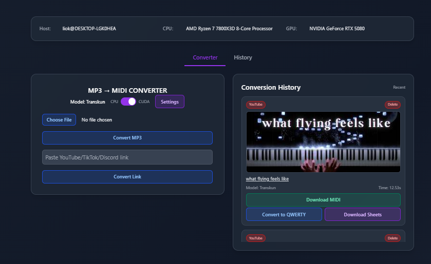
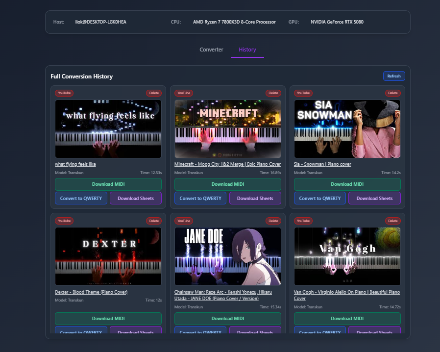

# 🎵 MP3 → MIDI CONVERTER

Web application for converting MP3 audio files to MIDI format using Transkun, with support for YouTube, TikTok, and Discord CDN links. Includes QWERTY sheet converter for MIDI files.

## ✨ Features

- MP3 to MIDI conversion using Transkun
- YouTube, TikTok, and Discord CDN link support
- QWERTY sheet converter
- CUDA/CPU toggle for processing
- Conversion history with delete functionality
- Customizable settings with live preview


## 📋 Requirements

- **Python**: [3.10.0](https://www.python.org/downloads/release/python-3100/)
- **FFmpeg**: [Required for audio processing](https://ffmpeg.org/download.html)
- **Transkun**: [Must be installed and in system PATH](https://github.com/Yujia-Yan/Transkun)
- **CUDA-capable GPU** (optional, CPU works too)

## 🚀 Installation

### Step 1: Clone the Repository

```bash
git clone <repository-url>
cd audioconverter-web
```

### Step 2: Install Python Dependencies

**For RTX 50xx Series GPUs (CUDA 12.9):**

If you have an RTX 50xx series GPU, install PyTorch with CUDA 12.9 support first:

```bash
pip3 install --pre torch torchvision torchaudio --index-url https://download.pytorch.org/whl/nightly/cu129
```

**Important:** All three packages (torch, torchvision, torchaudio) must be installed from the same source to ensure compatibility.

Then install the remaining dependencies (excluding torch and torchaudio):

```bash
pip install -r requirements.txt --no-deps torch torchaudio
```

**For other GPUs or CPU-only:**

```bash
pip install -r requirements.txt
```

This installs Flask, flask-wtf, Werkzeug, PyTorch, yt-dlp, pretty-midi, requests, flask-talisman, and pywebview.

### Step 3: Install Transkun

Ensure Transkun is installed and accessible from your command line:

```bash
transkun --version
```

If not installed, follow the [Transkun installation guide](https://github.com/Yujia-Yan/Transkun). Transkun must be in your system PATH.

### Step 4: Install FFmpeg

FFmpeg is required for audio processing. Install based on your operating system:

**Windows:**
- Download from [FFmpeg official website](https://ffmpeg.org/download.html)
- Extract and add to your system PATH
- Or use: `choco install ffmpeg` (if using Chocolatey)

**Linux:**
```bash
sudo apt-get update
sudo apt-get install ffmpeg
```

**macOS:**
```bash
brew install ffmpeg
```

### Step 5: Configure YouTube Cookies (Optional)

For downloading restricted or age-restricted YouTube videos, add your YouTube cookies to `cookies.txt`:

1. Install a browser extension to export cookies:
   - Chrome/Edge: [get NETSCAPE cookies by export](https://chromewebstore.google.com/detail/hlkenndednhfkekhgcdicdfddnkalmdm?utm_source=item-share-cb)
   - Firefox: [get NETSCAPE cookies by export](https://addons.mozilla.org/en-US/firefox/addon/cookie-editor/)

2. Export cookies from YouTube and save to `cookies.txt` in the project root directory

**Note:** Cookies expire after some time. If downloads start failing, re-export and update your `cookies.txt` file.

### Step 6: Verify Installation

Run a quick test to ensure everything is set up correctly:

```bash
python -c "import torch; print('CUDA available:', torch.cuda.is_available())"
transkun --version
ffmpeg -version
```

## 💻 Usage

Run the application:
```bash
python app.py
```

Or for GUI mode:
```bash
python app_gui.py
```

- Toggle CPU/CUDA mode before converting
- Upload MP3 files or paste YouTube/TikTok/Discord links
- Convert MIDI to QWERTY sheets with customizable settings
- Switch between Auto and Multi transpose modes in the sheet viewer

## ⚙️ Configuration

Environment variables:
- `SECRET_KEY` - Flask secret key (auto-generated)
- `UPLOAD_FOLDER` - Upload directory (default: `uploads`)
- `CONVERTED_FOLDER` - Output directory (default: `converted`)
- `FORCE_HTTPS` - Force HTTPS (default: `false`)

## 🔌 API Endpoints

- `POST /api/convert` - Start conversion: `{"media_url": "...", "device": "cuda"|"cpu"|null}`
- `GET /api/status/<task_id>` - Check conversion status
- `POST /api/stop/<task_id>` - Cancel conversion
- `POST /api/convert-to-sheets` - Convert MIDI to sheets: `{"midi_filename": "...", "settings": {...}}`
- `GET /api/history` - Get history (query: `limit`)
- `POST /api/history/delete` - Delete history item: `{"timestamp": <float>}`
- `GET /api/health` - Health check
- `GET /wallpapers` - Wallpaper check

## 🐛 Troubleshooting

- **Transkun not found**: Install and add to PATH
- **CUDA not available**: App works on CPU, auto-falls back if CUDA unavailable
- **FFmpeg not found**: Install and add to PATH
- **Download failed**: Check connection, URL validity, or use cookies.txt for YouTube

## 🙏 Credits

- **QWERTY Sheet Converter**: Based on [midi-converter](https://github.com/ArijanJ/midi-converter) by [@ArijanJ](https://github.com/ArijanJ) and [@Albacusphetical](https://github.com/Albacusphetical)
- **Transkun**: [Audio-to-MIDI transcription](https://github.com/Yujia-Yan/Transkun)