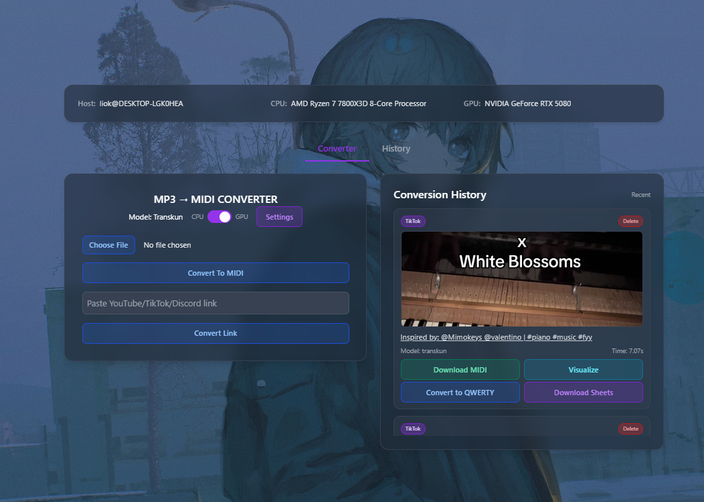
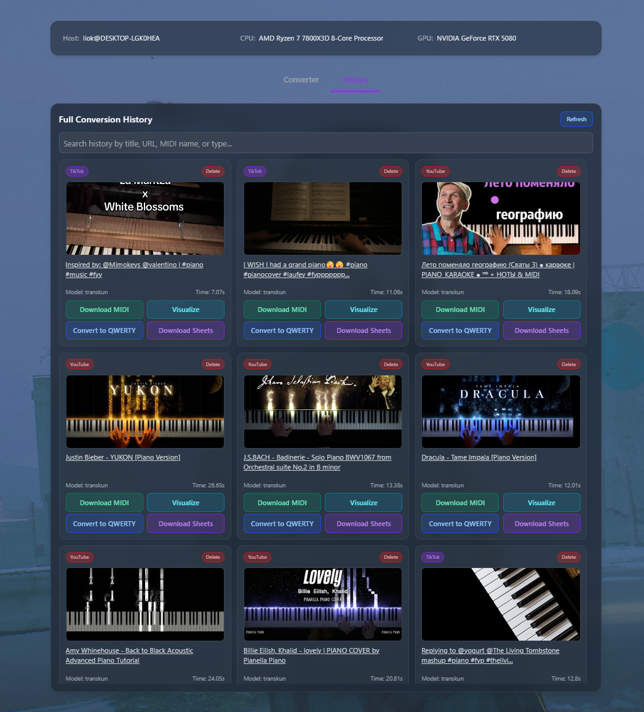

# 🎵 MP3 → MIDI CONVERTER

Web application for converting audio/video files and supported media links to MIDI format using Transkun. Supports local uploads, YouTube, TikTok, and Discord CDN links, plus QWERTY sheet conversion and MIDI visualization.

## ✨ Features

- Audio/video to MIDI conversion using Transkun
- Local uploads plus YouTube, TikTok, and Discord CDN link support
- QWERTY sheet converter with Auto and Multi transpose modes
- GPU/CPU toggle with CUDA, MPS, and CPU fallback
- MIDI upload, saved MIDI browser, and conversion history with delete functionality
- Piano visualizer with SoundFont playback from `soundfonts/*.sf2`
- Customizable settings, wallpaper backgrounds, and live preview
  
  

## 📋 Requirements

- **Python**: [3.10.0](https://www.python.org/downloads/release/python-3100/)
- **FFmpeg**: [Required for audio processing](https://ffmpeg.org/download.html)
- **Transkun**: [Required for audio-to-MIDI transcription](https://github.com/Yujia-Yan/Transkun)
- **CUDA-capable GPU** (optional, CPU works too)
- **SoundFont `.sf2` files** (optional, for piano visualizer playback)

## 🚀 Installation

### Step 1: Clone the Repository

```bash
git clone <repository-url>
cd audioconverter-web
```

### Step 2: Install Python Dependencies

Install all required packages, including PyTorch with CUDA support, in one go:

```bash
python -m pip install -r requirements.txt
```

### Step 3: Install Transkun

`requirements.txt` installs Transkun. The app uses the `transkun` command when available and falls back to the Python module. Verify at least one of these works:

```bash
transkun --help
python -m transkun.transcribe --help
```

If neither command works, follow the [Transkun installation guide](https://github.com/Yujia-Yan/Transkun).

### Step 4: Install FFmpeg

FFmpeg is required for audio processing. Install based on your operating system:

**Windows:**

- Download from [FFmpeg official website](https://ffmpeg.org/download.html)
- Extract and add to your system PATH
- Or use: `choco install ffmpeg` (if using Chocolatey)

**Linux:**

```bash
sudo apt-get update
sudo apt-get install ffmpeg
```

**macOS:**

```bash
brew install ffmpeg
```

### Step 5: Configure YouTube Cookies (Optional)

For downloading restricted or age-restricted YouTube videos, add your YouTube cookies to `cookies.txt`:

1. Install a browser extension to export cookies:
   - Chrome/Edge: [get NETSCAPE cookies by export](https://chromewebstore.google.com/detail/hlkenndednhfkekhgcdicdfddnkalmdm?utm_source=item-share-cb)
   - Firefox: [get NETSCAPE cookies by export](https://addons.mozilla.org/en-US/firefox/addon/cookie-editor/)

2. Export cookies from YouTube and save to `cookies.txt` in the project root directory

**Note:** Cookies expire after some time. If downloads start failing, re-export and update your `cookies.txt` file.

### Step 6: Verify Installation

Run a quick test to ensure everything is set up correctly:

```bash
python -c "import torch; print('CUDA available:', torch.cuda.is_available())"
python -c "import transkun, pretty_midi, yt_dlp; print('Python dependencies OK')"
ffmpeg -version
```

## 💻 Usage

Run the application:

```bash
python app.py
```

Or for GUI mode:

```bash
python app_gui.py
```

Helper launchers are also included:

- `run.bat` / `run.command` - browser mode
- `run_app.bat` / `run_app.command` - desktop window mode

- Toggle GPU/CPU mode before converting
- Upload audio/video files or paste YouTube/TikTok/Discord links
- Convert MIDI to QWERTY sheets with customizable settings
- Switch between Auto and Multi transpose modes in the sheet viewer
- Open saved MIDI files in the piano visualizer and choose a SoundFont

## ⚙️ Configuration

Environment variables:

- `SECRET_KEY` - Flask secret key (auto-generated)
- `UPLOAD_FOLDER` - Upload directory (default: `uploads`)
- `CONVERTED_FOLDER` - Output directory (default: `converted`)
- `FORCE_HTTPS` - Force HTTPS (default: `false`)

Local files and folders:

- `settings.json` - Saved UI, sheet, color, and wallpaper settings
- `cookies.txt` - Optional YouTube cookies in Netscape format
- `soundfonts/` - `.sf2` files used by the piano visualizer
- `wallpapers/` - Image/video backgrounds listed in the settings modal

## 🔌 API Endpoints

- `POST /api/convert` - Start URL conversion: `{"media_url": "...", "device": "gpu"|"cuda"|"mps"|"cpu"|null}`
- `GET /api/status/<task_id>` - Check conversion status
- `POST /api/stop/<task_id>` - Cancel conversion
- `POST /api/convert-to-sheets` - Convert MIDI to sheets: `{"midi_filename": "...", "settings": {...}}`
- `POST /api/upload-media` - Upload audio/video file for MIDI conversion
- `POST /api/upload-midi` - Upload existing `.mid` or `.midi` file
- `GET /api/midi-files` - List saved MIDI files
- `GET /api/history` - Get history (query: `limit`)
- `POST /api/history/delete` - Delete history item: `{"timestamp": <float>}`
- `GET /api/settings` - Get saved settings
- `POST /api/settings` - Save settings JSON
- `GET /api/soundfonts` - List available `.sf2` files
- `GET /api/wallpapers` - List available image/video wallpapers
- `GET /api/midi/<filename>` - Serve a converted MIDI file
- `GET /api/health` - Health check
- `GET /history.json` - Raw history JSON

## 🐛 Troubleshooting

- **Transkun not found**: Install and add to PATH
- **CUDA/MPS not available**: App works on CPU and auto-falls back if acceleration is unavailable
- **FFmpeg not found**: Install and add to PATH
- **Download failed**: Check connection, URL validity, or use cookies.txt for YouTube
- **Visualizer has no sound**: Add at least one `.sf2` SoundFont file to `soundfonts/`

## 🙏 Credits

- **QWERTY Sheet Converter**: Based on [midi-converter](https://github.com/ArijanJ/midi-converter) by [@ArijanJ](https://github.com/ArijanJ) and [@Albacusphetical](https://github.com/Albacusphetical)
- **Transkun**: [Audio-to-MIDI transcription](https://github.com/Yujia-Yan/Transkun)
- **FFmpeg**: Audio/video decoding and format conversion
- **yt-dlp**: YouTube, TikTok, and media link downloading
- **PyTorch**: CUDA, MPS, and CPU tensor runtime used by Transkun
- **Flask, Werkzeug, Flask-WTF, and Flask-Talisman**: Web server, forms, CSRF handling, and security headers
- **pretty-midi and SciPy**: MIDI processing and timing utilities
- **Requests**: HTTP requests and metadata downloads
- **pywebview and pywin32**: Optional desktop window mode and Windows integration
- **Tailwind CSS**: Frontend utility styling
- **@tonejs/midi**: Browser-side MIDI parsing for the piano visualizer
- **js-synthesizer and FluidSynth**: SoundFont-based MIDI playback in the piano visualizer
- **SoundFont and wallpaper creators**: Local files in `soundfonts/` and `wallpapers/` belong to their respective creators and licenses
- **Open-source maintainers**: Additional direct and transitive dependencies are listed in `requirements.txt` and `package-lock.json`