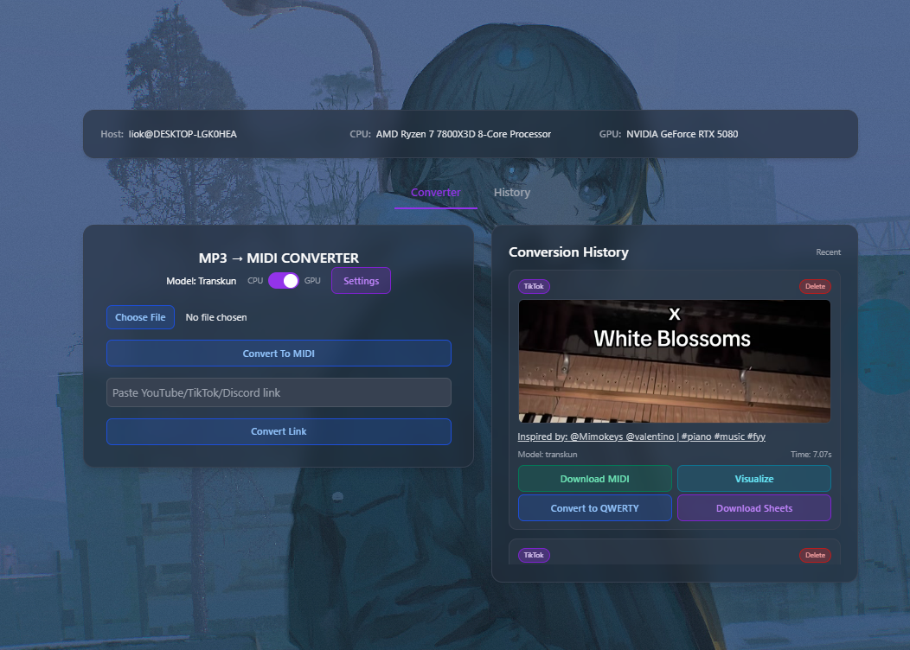

# MP3 to MIDI Converter

[](LICENSE)
[](https://www.python.org/)

A local Flask application that converts audio, video, and supported media links to MIDI with [Transkun](https://github.com/Yujia-Yan/Transkun). It also includes QWERTY sheet conversion, conversion history, a browser MIDI library, and a piano visualizer.



## Features

- Convert local audio and video files to MIDI.
- Download and convert supported YouTube, TikTok, Discord CDN, and MuseScore links.
- Use CUDA, Apple MPS, or CPU with automatic fallback.
- Convert MIDI files to QWERTY sheets with transpose and quantization controls.
- Browse conversion history and saved MIDI files.
- Play MIDI files in the browser with optional local SoundFont files.
- Run in a browser or in an optional PyWebView desktop window.
- Optional Chromium extension for sending supported pages to the local app.

## Requirements

- Python 3.10 or newer.
- [FFmpeg](https://ffmpeg.org/download.html) available on `PATH`.
- A modern browser.
- Optional: an NVIDIA CUDA setup or Apple Silicon for faster transcription.
- Optional: one or more `.sf2` files for SoundFont playback.

Transcription is compute-intensive. CPU mode works, but a compatible GPU is considerably faster.

## Installation

```bash
git clone https://github.com/LioK251/mp3converter.git
cd mp3converter
python -m venv .venv
```

Activate the virtual environment:

```powershell
# Windows PowerShell
.\.venv\Scripts\Activate.ps1
```

```bash
# macOS or Linux
source .venv/bin/activate
```

Install the Python dependencies:

```bash
python -m pip install --upgrade pip
python -m pip install -r requirements.txt
```

For a specific CUDA build, install the matching PyTorch packages from the [official PyTorch selector](https://pytorch.org/get-started/locally/) before installing `requirements.txt`. Keep `torch`, `torchvision`, and `torchaudio` on the same index and release channel.

Verify the external tools:

```bash
ffmpeg -version
python -c "import torch, transkun, yt_dlp; print('Dependencies OK'); print('CUDA:', torch.cuda.is_available())"
```

## Usage

Start the browser version:

```bash
python app.py
```

Start the optional desktop window:

```bash
python app_gui.py
```

The Windows launchers `run.bat` and `run_app.bat` perform the same actions. macOS launchers are provided as `run.command` and `run_app.command`.

By default, the server is available at `http://127.0.0.1:5000`.

## Optional local files

These files are deliberately excluded from Git because they contain user data, credentials, third-party media, or very large binaries:

- `cookies.txt` — optional Netscape-format cookies used by yt-dlp.
- `soundfonts/*.sf2` — local SoundFont files for the piano visualizer.
- `wallpapers/` — custom image or video backgrounds.
- `uploads/`, `converted/`, `history.json`, `settings.json`, `instance/` — runtime data.

Create an empty cookies file from the safe template only if you need it:

```powershell
Copy-Item cookies.example.txt cookies.txt
```

```bash
cp cookies.example.txt cookies.txt
```

Never commit real browser cookies. If they were ever published, revoke the affected sessions and rotate the cookies.

The piano visualizer works without a SoundFont selection, but local SoundFont playback requires placing a legally distributable `.sf2` file in `soundfonts/`.

## Browser extension

The optional extension lives in `extension/` and expects the application at `http://127.0.0.1:5000`.

1. Open `chrome://extensions` (or the equivalent page in a Chromium browser).
2. Enable Developer mode.
3. Choose **Load unpacked** and select the `extension` directory.

## Configuration

Environment variables:

- `SECRET_KEY` — Flask session secret. A random value is generated for local use when omitted.
- `UPLOAD_FOLDER` — upload directory; defaults to `uploads`.
- `CONVERTED_FOLDER` — output directory; defaults to `converted`.
- `FORCE_HTTPS` — enable HTTPS-oriented security headers and secure cookies when set to `1`, `true`, or `yes`.
- `HOST` — bind address; defaults to `127.0.0.1`.
- `PORT` — bind port; defaults to `5000`.

## Security and privacy

- The project is designed primarily as a local application. Do not expose the Flask development server directly to the public internet.
- Media URLs and uploaded files may be sent to third-party services named in those URLs.
- Review the terms of service and copyright rules applicable to media you download or convert.
- Local cookies, conversion history, uploads, settings, logs, wallpapers, and SoundFonts are ignored by Git.

## License

The application source is released under the [MIT License](LICENSE). Bundled or user-supplied media, models, SoundFonts, wallpapers, and third-party libraries remain subject to their own licenses.

## Credits

- [Transkun](https://github.com/Yujia-Yan/Transkun) for audio-to-MIDI transcription.
- [yt-dlp](https://github.com/yt-dlp/yt-dlp) and FFmpeg for media download and processing.
- [midi-converter](https://github.com/ArijanJ/midi-converter) for the QWERTY sheet-conversion foundation.
- Flask, PyTorch, pretty-midi, SciPy, Tone.js MIDI, and js-synthesizer contributors.
